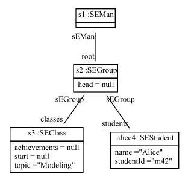

# Scenario call registerStudent.

There is the SEMan. 
SEMan has root SEGroup. 

There is the SEGroup. 

There is an SEStudent with name Alice and with studentId m42 and with sEGroup SEGroup. 
There is an SEClass with topic Modeling and with sEGroup SEGroup. 

We call registerStudent on SEMan 
with student Alice and with seClass Modeling. 

RegisterStudent creates an Achievement with id A1 and with sEStudent Alice.
