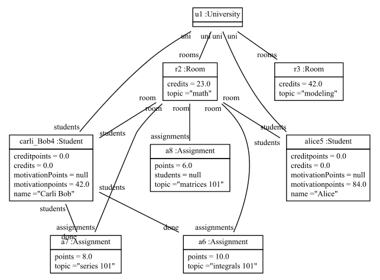

# Scenario Karli does the first math assignments

## Setup

Study Right is a University with students Carli Bob and Alice
and with rooms the math room and the modeling room.

There is a student with name Carli Bob
and with 42.0 motivation points,
and with 0.0 credit points
and with done Integrals and Series
and with room math room.

There is a student with name Alice,
with 84.0 motivation points,
with 0.0 credit points,
and with room math room.

There is the math room a room with topic math and with 23 credits
and with assignments Integrals, Series, and Matrices
and with students Carli Bob and Alice.

There is the modeling room a room with topic modeling and with 42 credits.

Integrals is an assignment with topic integrals 101 and with 10 points.
Series is an assignment with topic series 101, with 8 points.
Matrices is an assignment with topic matrices 101, with 6 points.

Utils is a Study Right Utils.

