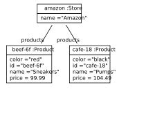
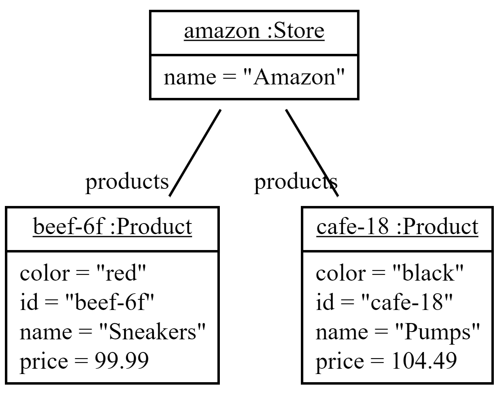
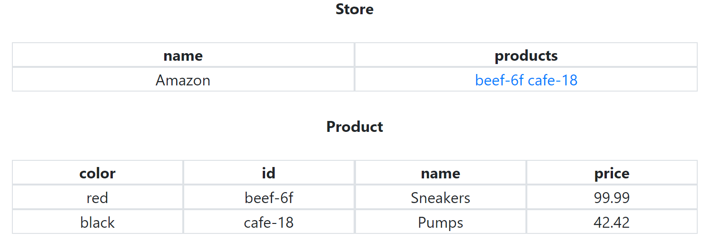

# Test Sentences

## Expect Sentences

Expect Sentences allow you to verify certain properties of your data model. In Java tests, these are called assertions, and that is what these sentences translate to. In essence, they consist of the keywords `we expect` followed by one or more [conditional expressions](../expressions/conditionals.md). Each `that` clause will create an additional assertion statement.

```text
We expect that 1.5 is 1.5.
We expect that 'str' is 'str'.
We expect that credits of Alice is 20.
We expect that name of Bob is "Bob".

We expect that 1 is not 2.
We expect that credits of Alice is not 30.

We expect that alice is the same as Alice.
We expect that 'alice' is not the same as Alice.

We expect that 10 is less than 20.

We expect that numbers contain 3.
We expect that integers do not contain 1.5.

We expect that 1 is 1 and that 2 is 2.
```

```java
assertEquals(1.5, 1.5, 0);
assertEquals("str", "str");
assertEquals(alice.getCredits(), 20, 0);
assertEquals(bob.getName(), "Bob");

assertNotEquals(1, 2, 0);
assertNotEquals(alice.getCredits(), 30, 0);

assertSame(alice, alice);
assertNotSame("alice", alice);

assertTrue(10 < 20);

assertThat(numbers, hasItem(3));
assertThat(integers, not(hasItem(1.5));

assertEquals(1, 1);
assertEquals(2, 2);
```

```markup
<expectSentence> ::= we expect <thatClauses> .
<thatClauses> ::= <thatClause> (<sep> <thatClause>)*
<thatClause> ::= that <condExpr>
```

## Diagram Sentences

Diagram sentences allow you to visualize object structures by creating files that display them. There are many kinds of formats you can use. Which one depends on the file extension of the file name.

> #### ⓘ Hint
>
> The examples below are derived from the following scenario, with `<fileName>` being the filename shown in the examples:
> 
> ```text
> There is a Product with name Sneakers, with id beef-6f, with price 99.99, and with color red.
> There is a Product with name Pumps, with id cafe-18, with price 104.49, and with color black.
> 
> There is a Store with name Amazon.
> Amazon has products Sneakers and Pumps.
> 
> 
> ```

* `.png` creates ordinary images of object diagrams. They may have low resolution and are not suitably for high definition viewing. Example:



* `.svg` creates object diagrams in [SVG](https://en.wikipedia.org/wiki/Scalable_Vector_Graphics) format. This can be scaled to any size, making it useful for embedding in websites or printing. You can also select the text in the diagrams.



* `.yaml` visualizes object structures in the format used by [fulibYaml](https://github.com/fujaba/fulibYaml).

```yaml
- amazon1: 	Store
  name: 	Amazon
  products: 	beef_6f2 	cafe_183 	

- beef_6f2: 	Product
  color: 	red
  id: 	"beef-6f"
  name: 	Sneakers
  price: 	99.99

- cafe_183: 	Product
  color: 	black
  id: 	"cafe-18"
  name: 	Pumps
  price: 	104.49
```

* `.txt` allows you to write the string representation of objects to a file. When passing a list, each item is written on a new line.

```markup
Amazon
Sneakers beef-6f red
Pumps cafe-18 black
```

* `.tables.html` formats object structures as interlinked HTML tables.



```markup
<diagramSentence> ::= 
<fileName> ::= one or more arbitrary characters except ')'
```

